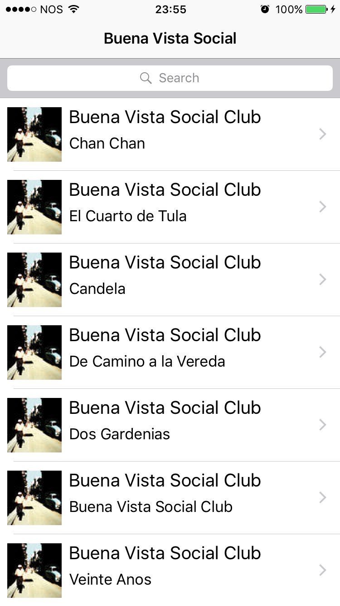
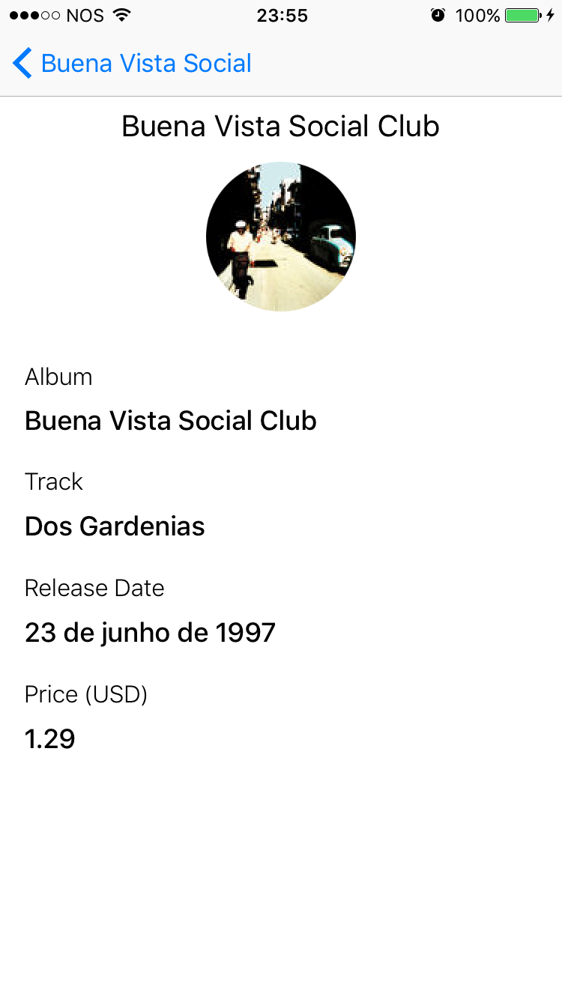

# ITunesSearch
This is a small test to do a iTunes song search.

The search uses the defaults iTunes Search API: https://affiliate.itunes.apple.com/resources/documentation/itunes-store-web-service-search-api/

For example, doing a search for 'Buena Vista Social' we get a list view like this:

And the detail view:

